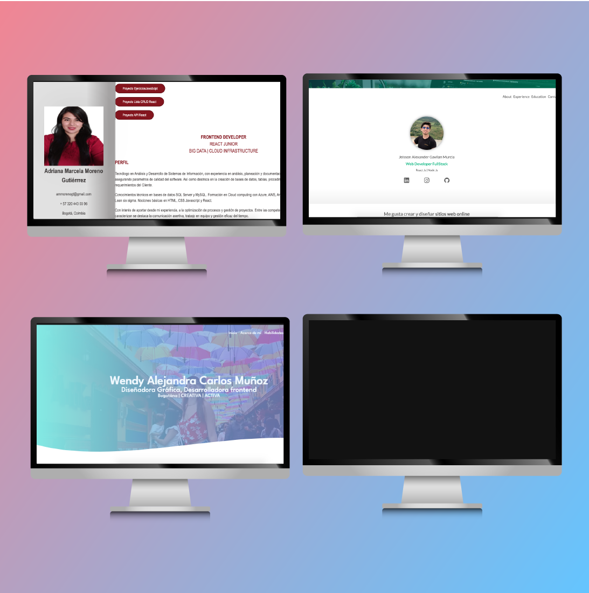
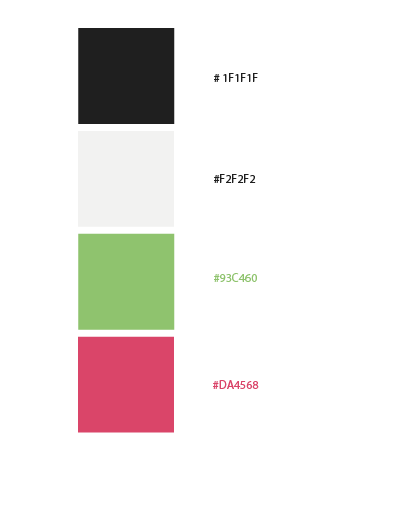
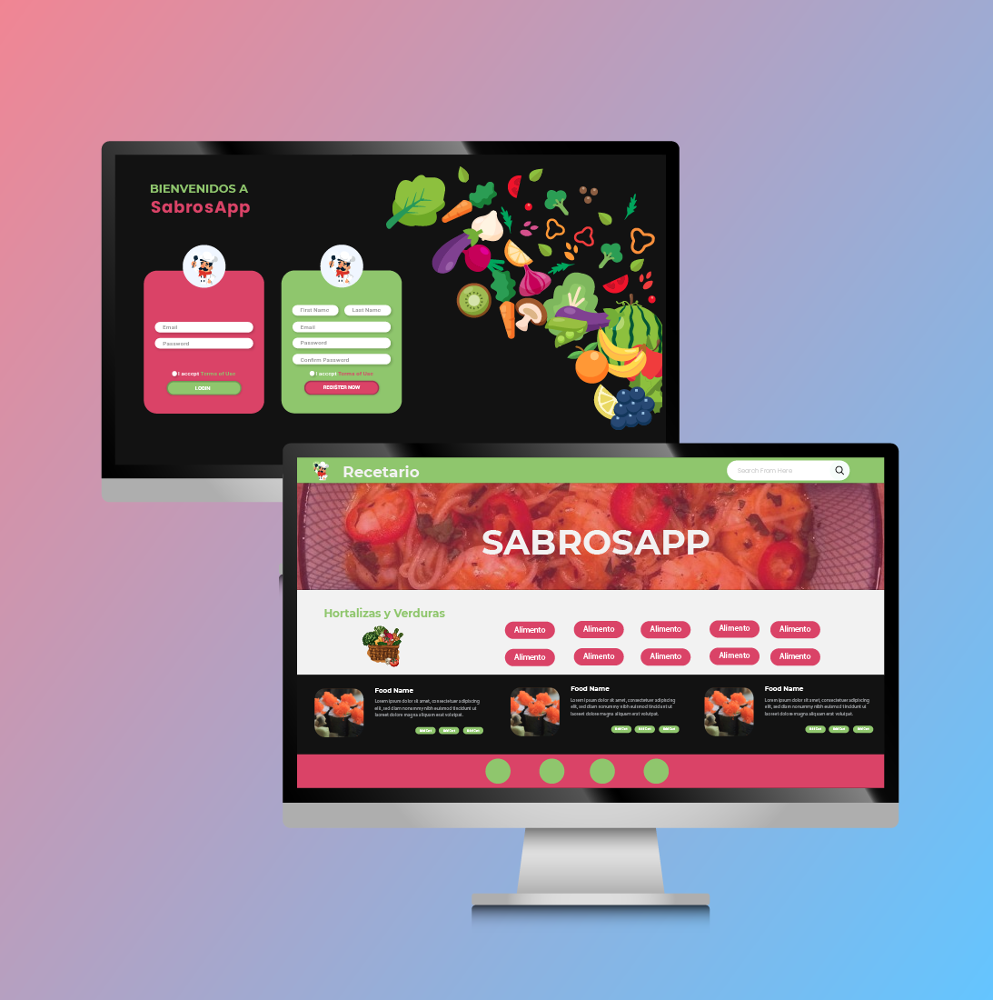

<h1 style="color:#DA4367">SABROSAPP</h1>

## Descripción:

Todo en un mismo lugar! En esta aplicación encontrarás cientos de recetas que puedes preparar con los ingredientes que tienes en casa, olvídate de pensar por horas que preparar, explora sabores y crea maravillas con la creatividad de los miembros de la comunidad que suben sus mejores recetas. Únete a FoodiesApp.

*Participantes*

1. Adriana Moreno
2. Eleiza Caridad
3. Jeisson Gavilán
4. Wendy Carlos

### Responsable Repositorio y Despliegue

Jeisson Gavilán

### Responsable de Documentación

Adriana Moreno

### Responsable de Wireframe de baja

Eleiza Caridad

### Responsable de Wireframe de alta

Wendy Carlos

## Horarios

| Día       | Hora            |
| --------- | --------------- |
| - Martes  | 3:00pm a 4:00pm |
| - Jueves  | 3:00pm a 4:00pm |
| - Viernes | 3:00pm a 4:00pm |

## API

<a href="https://www.themealdb.com/" target="_blank" rel="noopener noreferrer">Vínculo</a>

## Trello

<a href="https://trello.com/invite/b/fMVJOlsv/ATTI9f9dde31053aec7691f80ab5cdc8b9d54050BBCB/tecno-power" target="_blank" rel="noopener noreferrer">Vínculo</a>

 

## Tecnologías utilizadas

- React
- Vite
- Bootstrap
- Sass

 

## Requerimientos

- Node.js (v18.9.0 o superior)
- NPM (8.19.1 o superior)

## Instalación

Clona el repositorio en tu máquina local.
Abre una terminal y navega hacia el directorio del proyecto.

Ejecuta el siguiente comando para instalar las dependencias:

    npm install

Ejecuta este comando para iniciar el proyecto:

    npm run dev

## Guía de estilos de Tecno Power

Logo 

Colores

Tipografía:

SanSerif : futura medium bt
 
SanSerif : Morganite

## Wireframe Alta Tecno Power

## Guía de estilos FoodiesApp

Colores

Tipografía:

SanSerif : futura medium bt
 
SanSerif : Morganite

## Wireframe de Baja FoodiesApp

 

 

## Wireframe Alta FoodiesApp

 

## Ramas de GitHub

- El proyecto se compone de la rama Main, desarrollo y colaboradores.

## Asesoría

Docente : Javier Andres 
 
Bit: Desarrollo Front End React